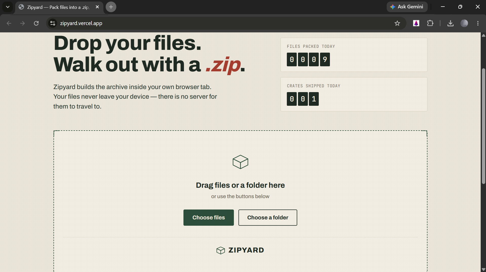

# 📦 Zipyard



**A local packing yard for your files — no uploads, no server, no account.**

Zipyard is a lightweight, browser-based tool that packs files and folders into a `.zip` archive entirely on your own device. There's no backend, no database, and no data transfer of any kind — your files never leave the tab they're dropped into.

---

## ✨ What it does

- **Drag and drop** files *or* whole folders directly into the browser
- **Preserves folder structure** inside the generated archive
- Builds the `.zip` **in memory**, on your machine, using [JSZip](https://stuk.github.io/jszip/)
- Shows a live **packing list** — file names, sizes, and running totals — before you commit
- Lets you **rename the archive** before downloading
- Tracks simple, on-device **daily counters** (files packed / archives shipped) with no server involved
- Wrapped in a clean, custom **"shipping yard" visual identity** — no default AI-template styling

---

## 🧱 Project structure

```
zipyard/
├── index.html     → Page structure and content
├── styles.css     → Visual design system (layout, color, type, motion)
└── index.js       → Drag-and-drop handling, zip creation, and UI logic
```

---

## 🚀 Using it

1. Open the site.
2. Drop in files or a folder, review the packing list, and click **Pack into .zip**.

That's it — the browser handles the rest and offers the finished archive as a normal download.

> **Note:** Zipyard loads the [JSZip](https://stuk.github.io/jszip/) library from a CDN on first load. This is the only network request the page makes — your actual files are never sent anywhere.

---

## 🛠️ How it works

| Step | What happens |
|------|---------------|
| **1. Select** | Files are read locally through the browser's native File API — no upload step exists. |
| **2. Pack** | JSZip assembles the archive in memory, preserving relative folder paths and compressing with DEFLATE. |
| **3. Download** | The browser triggers a standard file download. Close the tab, and nothing related to the session persists anywhere but your device (aside from the local daily counters). |

---

## 🎨 Design notes

Zipyard's visual identity is built around a shipping-yard metaphor — crates, packing tape, dashed cut-lines, and a rubber-stamp confirmation moment — rather than generic dashboard styling. Typography pairs **Archivo** (display/body) with **JetBrains Mono** (data, counters, file paths) to separate narrative text from technical detail at a glance.

---

## 🙋 About

Zipyard was built to solve a simple problem: packing files into a `.zip` shouldn't require uploading them anywhere. It's a small, focused tool — designed with a clear, human point of view rather than a generic dashboard look.

---

## 📄 License

This project is free to use, modify, and build on for personal or commercial projects.
